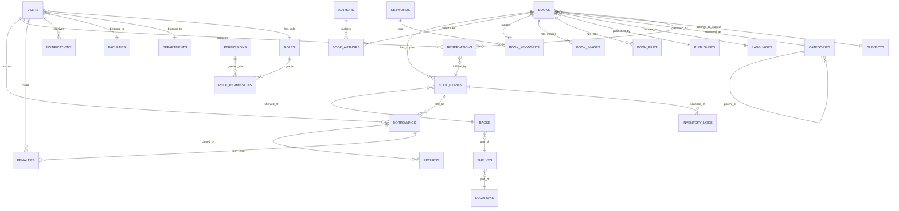

# ILMS — Database Schema (Phase 2)

Source of truth: `supabase/migrations/*.sql`. Validated end-to-end by
applying every migration against a real Postgres engine (pglite) — all 30
tables, triggers, and RLS policies create cleanly with no forward-reference
errors.

## Design notes

- **Bibliographic vs. item split** (Koha/MARC convention): `books` describes
  the *title* (one row per work/edition). `book_copies` describes each
  *physical item* — its own inventory number, barcode, shelf location,
  status, price, and acquisition date. A title with 10 copies is 1 row in
  `books` and 10 rows in `book_copies`.
- **Physical location** is a 3-level hierarchy: `locations` (library
  fund/section — "kutubxona fondi", "bo'lim") → `shelves` (cabinet —
  "tokcha/javon") → `racks` (individual rack — "raf"). `book_copies.rack_id`
  points to the leaf.
- **Two-tier authorization**: `app_role` (enum, mirrored into the Supabase
  JWT `app_metadata.role` claim by a trigger) drives Row Level Security —
  fast, no joins. `roles` / `permissions` / `role_permissions` is the
  admin-configurable permission catalog the backend's authorization layer
  and Admin Panel read for fine-grained checks.
- **Reservations** are placed against a *title* (`books.id`), not a specific
  copy, and fulfilled from whichever copy becomes free first — matching
  Koha's hold queue behavior.
- **`borrowings` vs. `returns`**: `borrowings` is the loan's lifecycle header
  (issue → renewals → returned_at); `returns` is the physical hand-back
  event log (condition inspected, staff who received it), kept separate so
  a loan can be queried without joining every return detail.

## Entity relationship diagram



## Table reference

| Table | Purpose |
|---|---|
| `users` | Profile extending `auth.users` — staff and readers alike (FISH, JSHSHIR, faculty/department, role, library card barcode, QR). |
| `roles` / `permissions` / `role_permissions` | Admin-configurable RBAC permission catalog. |
| `languages`, `publishers`, `authors`, `faculties`, `departments`, `subjects`, `categories`, `keywords` | Bibliographic reference/lookup data. |
| `locations`, `shelves`, `racks` | Physical shelving hierarchy. |
| `books` | Bibliographic (title) records — ISBN, UDK, BBK, annotation, etc. |
| `book_authors`, `book_keywords` | Many-to-many junctions for multi-author books and keyword tagging. |
| `book_images` | Cover/gallery images (Supabase Storage paths). |
| `book_copies` | Per-copy inventory: inventory number, barcode, shelf location, status, price, acquisition. |
| `book_files` | Electronic library files (PDF/DOCX/PPT/audio/video/zip), per-file download toggle. |
| `borrowings` | Loan lifecycle (issue, due date, renewals, returned_at). |
| `returns` | Return event detail (condition, received by). |
| `reservations` | Title-level hold queue. |
| `penalties` | Fines (overdue, lost, damage). |
| `inventory_logs` | Barcode-scan stocktake/shelf-check results. |
| `audit_logs` | Generic who/when/what change trail. |
| `notifications` | Channel-agnostic outbox (email/SMS/Telegram/system). |
| `settings` | Key-value system configuration (loan days, fine rate, etc.). |
| `opac_search_logs` | OPAC search analytics (anonymous-friendly). |

## Regenerating TypeScript types

Once this schema is pushed to a live Supabase project:

```bash
supabase gen types typescript --project-id <project-ref> \
  > frontend/src/types/database.ts
cp frontend/src/types/database.ts backend/src/types/database.ts
```
